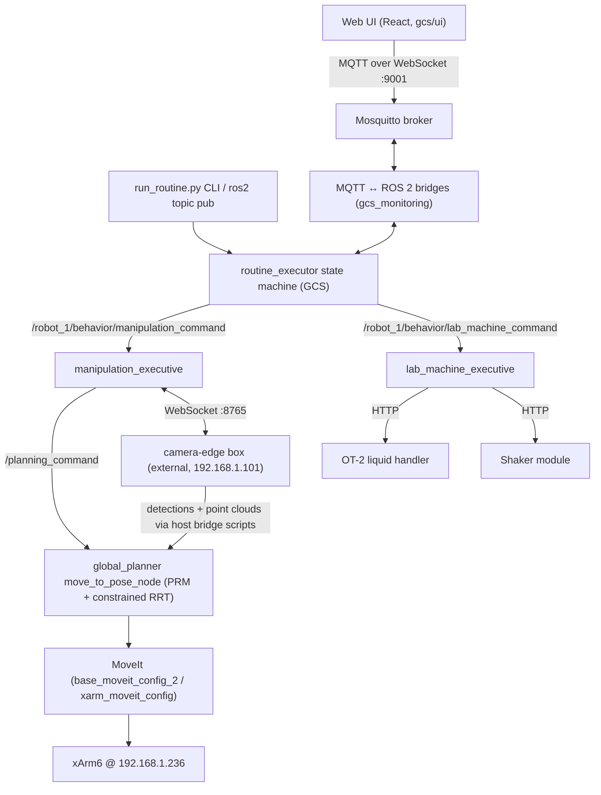

# Autolab

Autolab is the MRSD APEX Labs (CMU) **self-driving laboratory robot**: a UFACTORY xArm6 arm with a custom parallel gripper, mounted on a swerve-drive base, that shuttles well plates between laboratory machines — an **Opentrons OT-2** liquid handler and a **custom shaker module** — and triggers their protocols. A full lab routine (pick plate → load OT-2 → pipette → move to shaker → shake → retrieve) can be launched from a **web UI** and monitored live.

> **Safety:** many commands in this repo move a real robot arm. Keep the physical e-stop within reach, clear the workspace, and never run two things that command the arm at the same time (e.g. joystick teleop + MoveIt).

## What the system can do

- **Manipulation** — vision-guided pick/place of well plates (pick from base, pick from a machine, place into OT-2 or shaker) using AprilTag + well-plate detections, a taught-waypoint PRM motion planner, and MoveIt with live octomap collision avoidance. ⚠ *Place* currently only hovers 25 cm above the target machine's AprilTag and dwells — **there is no autonomous gripper control yet** (see [known issue #21](docs/known-issues.md)).
- **Lab machine control** — run OT-2 pipetting protocols (pick_up_tips / aspirate / dispense / return_tips) and set shaker PWM over HTTP.
- **Routine execution** — a retrying step state machine (`routine_executor`) runs multi-step routines defined as JSON, commanded from the web UI, a CLI, or raw ROS topics.
- **Perception** — dual ZED cameras + Velodyne VLP-16 fusion; detection inference runs on an external "camera-edge" box and is bridged into ROS 2.
- **Teleop** — direct Xbox-controller Cartesian jogging of the arm (bypasses ROS entirely).
- **Simulation** — Isaac Sim scene of the robot (partially wired).

## Architecture at a glance



## Hardware

| Hardware | Address / interface | Where configured |
|---|---|---|
| UFACTORY xArm6 (6-DOF arm) | `192.168.1.236` | `robot/ros_ws/src/autonomy/5_planning/planning_bringup/launch/planning.launch.xml` |
| Custom parallel gripper | Modbus RTU on xArm tool RS-485 | `joy_cartesian_jog.py` |
| Swerve-drive mobile base | ros2_control joints | `robot/ros_ws/src/autonomy/5_planning/base_urdf/robot.urdf` |
| Dual ZED cameras | serials `41591402` / `44405253` | `robot/docker/docker-compose.yaml` (`zed-l4t`) |
| Velodyne VLP-16 LiDAR | `/velodyne_points` | `pointcloud_lidar_accumulated.py` |
| Intel RealSense D435i (arm) | vendored support | `robot/ros_ws/src/autonomy/5_planning/xarm_ros2/xarm_vision/` |
| Camera-edge box (Jetson Xavier, `xavier.autolab`) | `autolab@192.168.1.101`, WS ports 8765–8767 | `~/Autolab-Camera-Edge` on that machine — **not in this repo** ([docs](docs/subsystems/xavier.md)) |
| Opentrons OT-2 | `http://192.168.10.4:8000` (host `192.168.10.9`) | `.../lab_machine_executive/config/lab_machines.yaml` |
| Custom shaker | `http://192.168.10.14/pwm_control/` | same |
| On-robot compute | NVIDIA Jetson (L4T r36.4) | `robot/docker/docker-compose.yaml` (`robot-l4t`) |

## Quickstart

```bash
git clone git@github.com:MRSD-APEXLabs/Autolab.git
cd Autolab
./autolab setup          # installs the `autolab` shell function
autolab install          # installs docker etc. (first time only)
autolab up robot         # builds/starts the robot container (auto-launches the stack in tmux)
autolab connect robot    # shell into the container (lands in the ROS 2 workspace)
```

Inside the container, `bws` builds the workspace, `sws` sources it. See **[docs/running.md](docs/running.md)** for the full end-to-end bringup including the GCS, MQTT bridges, and web UI — several glue nodes must be started manually and are easy to miss.

## Repository layout

| Path | What it is |
|---|---|
| `autolab.sh`, `.autolab/` | The `autolab` CLI (docker compose wrapper) and its plugin modules |
| `docker-compose.yaml`, `.env` | Root compose (currently includes **only** the robot stack) and all launch/env configuration |
| `robot/ros_ws/src/autonomy/` | The ROS 2 autonomy stack, staged `0_interface` … `6_behavior` |
| `robot/*.py`, `robot/*.json`, `robot/*.bin` | PRM roadmap + taught-waypoint tools and data |
| `gcs/ros_ws/src/` | Ground Control Station: `routine_executor`, MQTT bridges, rqt/RViz operator panels |
| `gcs/ui/` | The React web UI |
| `gcs/docker/` | GCS + Mosquitto + Elasticsearch/Kibana + UI containers |
| `common/ros_packages/` | Shared packages (messages, behavior-tree infra) mounted into both workspaces |
| `simulation/isaac-sim/` | Isaac Sim scenes and container |
| `docs/` | This documentation site |
| `pointcloud_lidar*.py`, `pc4.py`, `joy_cartesian_jog.py`, `mobility/` | ⚠ machine-local scripts/data (not yet in git) — perception bridges, teleop, LiDAR↔camera extrinsic |

## Documentation

Full documentation lives in [docs/](docs/) and is served as a browsable site:

```bash
docker compose --env-file .env -f docs/docker/docker-compose.yaml up docs
# then open http://localhost:8000
```

Start with:

- [docs/index.md](docs/index.md) — what the system does
- [docs/setup.md](docs/setup.md) — environment, networking, `.env`
- [docs/planning-quickstart.md](docs/planning-quickstart.md) — copy-paste commands to get planning running (verified on hardware)
- [docs/running.md](docs/running.md) — the end-to-end runbook (robot → GCS → UI)
- [docs/known-issues.md](docs/known-issues.md) — **read this before debugging anything**
