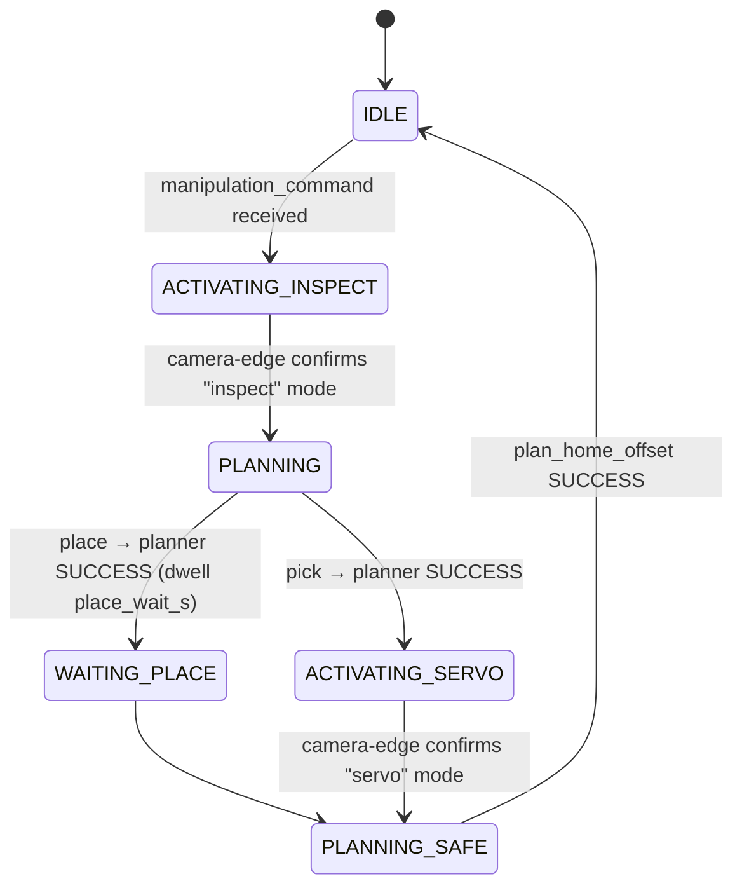

# Behavior & Executives

**Purpose:** the task layer that turns a single step command ("place the plate into the OT-2") into a choreography of camera-mode switches, planner commands, and lab-machine HTTP calls.

All paths below are under `robot/ros_ws/src/autonomy/6_behavior/`.

## Components

| Package | Node | Role |
|---|---|---|
| `behavior_tree` | `behavior_tree_implementation` | Executes the string-matched behavior tree in `config/drone.tree` |
| `behavior_executive` | `behavior_executive` | Generic conditions/actions (arm/disarm, pause, fixed trajectory, …) — castacks drone heritage, mostly unused for the lab task |
| `manipulation_executive` | `manipulation_executive` | **Pick/place phase machine** — the heart of this layer |
| `lab_machine_executive` | `lab_machine_executive` | OT-2 + shaker control over HTTP |
| `behavior_bringup` | — | `behavior.launch.xml` aggregates the above (with topic remaps) |
| `rqt_behavior_tree_command`, `rqt_fixed_trajectory_generator` | rqt plugins | Manual BT commands / canned trajectories |

```bash
ros2 launch behavior_bringup behavior.launch.xml
# or individually:
ros2 launch manipulation_executive manipulation_executive.launch.xml
ros2 launch lab_machine_executive lab_machine_executive.launch.xml
ros2 run behavior_tree behavior_tree_implementation
```

## The behavior tree

`behavior_tree/config/drone.tree` (the filename is drone-project heritage) defines a top-level parallel with two branches:

1. **Lab machines:** `(Command Lab Machine)` → `(OT2 Liquid Handler)` → `[Execute OT2 Protocol]` | `(Custom Shaker Module)` → `[Execute Shaker Protocol]`
2. **Manipulation/motion:** `[Pick Up Object]`, `[Place Object]`, `[Pick Base Object]`, `[Pick Wellplate]`, plus generic `Pause`/`Rewind`/`Follow Fixed Trajectory`/`Arm`/`Disarm` and an `Autonomously Explore` subtree.

**Topic naming convention** (auto-derived from node labels in `behavior_tree.cpp`): a condition `(Foo Bar)` reads `foo_bar_success` (`std_msgs/Bool`); an action `[Foo Bar]` publishes its wish on `foo_bar_active` (`behavior_tree_msgs/Active`) and reads `foo_bar_status` (`behavior_tree_msgs/Status`). Example: `[Pick Base Object]` ↔ `behavior/pick_base_object_active` / `behavior/pick_base_object_status`. These `*_status` topics are exactly what [`routine_executor`](gcs.md) watches to decide a step succeeded (they are BEST_EFFORT/depth-1 — see the [QoS note](../ros2-primer.md#qos-a-real-gotcha-here)).

## `manipulation_executive` — the pick/place phase machine

Source: `manipulation_executive/src/manipulation_executive.cpp`. Params: `camera_edge_host` = `192.168.1.101` and `camera_edge_port` = `8765` are set in `launch/manipulation_executive.launch.xml`; `place_wait_s` (default `10.0`) is declared in the code and **not** overridden by the launch file.

**Subscribes** `manipulation_command` (`behavior_tree_msgs/ManipulationCommand{type, object_type, target_machine}`) and `/planning_state`; **publishes** `manipulation_phase` (String, for debugging) and `/planning_command`. 20 Hz tick.



!!! warning "What `place` actually does today"
    `WAITING_PLACE` is a placeholder: `std::this_thread::sleep_for(place_wait_s)` returning `true`. A place therefore means *plan to 25 cm above the machine's AprilTag → wait 10 s → plan home → report SUCCESS*. **Nothing lowers the plate and nothing opens the gripper.** The grasp on pick steps is done by the [Xavier's servo mode](xavier.md) (visual servoing + FSR-based Modbus gripper close), not by ROS; the executive only waits for that worker to go idle and never checks whether it actually grasped ([#34](../known-issues.md)); and with the Xavier's `DEBUG = True` no servo motion happens at all ([#32](../known-issues.md)). Target ids are hardcoded: `ot2` → tag 1, `shaker` → tag 2; any other `target_machine` aborts. See [known issues #21 and #24](../known-issues.md). Note also that `pick_wellplate` can never dispatch because `step_config.py` sends `type='pick'` ([#22](../known-issues.md)).

Two side channels drive the phases:

- **Camera-edge WebSocket** (`ws_round_trip` via Boost.Beast to `192.168.1.101:8765`): sends `{"cmd":"mode","mode":"inspect"|"servo"}` then polls `{"cmd":"status"}` every 500 ms, up to `MAX_POLLS = 240` (120 s; the code comment still says 30 s — stale after commit `a017ccc`).
- **Planner topics:** publishes `plan_wellplate` / `plan_april_1` (OT-2) / `plan_april_2` (shaker) / `plan_home_offset` on `/planning_command`, then waits for `SUCCESS`/`ERROR` on `/planning_state`.

If the camera-edge box is down, commands stall in `ACTIVATING_INSPECT` until the poll limit and fail — see [known issue #9](../known-issues.md).

## `lab_machine_executive` — OT-2 and shaker

Source: `lab_machine_executive/src/lab_machine_executive.cpp`. Config `config/lab_machines.yaml`:

```yaml
ot2_base_url: "http://192.168.10.4:8000"
ot2_host: "192.168.10.9"
shaker_base_url: "http://192.168.10.14"
shaker_endpoint: "/pwm_control/"
```

Subscribes `lab_machine_command` (`behavior_tree_msgs/LabMachineCommand{device, action, parameters_json}`) and drives the machines over **HTTP POST via libcurl** (30 s timeout, no auth):

- **OT-2:** `POST <ot2_base_url>/robot/connect {"host": ot2_host}` → one call per protocol step (`pick_up_tips` / `aspirate` / `dispense` / `return_tips`) → `/robot/home` → `/robot/disconnect`.
- **Shaker:** `POST <shaker_base_url><shaker_endpoint>` with form body `pwm=<n>`.

Manual test commands (verbatim in `test commands.txt` / `test_full_routine.sh`):

```bash
ros2 topic pub --once /behavior/lab_machine_command behavior_tree_msgs/msg/LabMachineCommand \
  "{device: 'shaker', action: 'protocol', parameters_json: '{\"pwm\": 100}'}"
```

## rqt panels

After `bws && sws`, run `rqt --force-discover` — the plugins appear under *Miscellaneous Tools*:

- `rqt_behavior_tree_command` (config `config/gui_config.yaml`) — buttons that publish `BehaviorTreeCommands`
- `rqt_fixed_trajectory_generator` (config `config/fixed_trajectories.yaml`) — canned `FixedTrajectory` publisher
- From `common/ros_packages`: `rqt_behavior_tree` (live tree view) and `rviz_behavior_tree_panel` (⚠ excluded from builds — known non-building)
