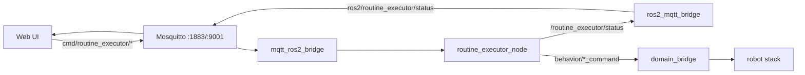

# Ground Control Station (GCS)

**Purpose:** the operator-side half of the system: the routine state machine, the MQTT bridges that connect the web UI to ROS, the RViz/rqt operator console, and log monitoring.

Paths: `gcs/ros_ws/src/` and `gcs/docker/`.

## Starting the GCS

```bash
# one-time: in the ROOT docker-compose.yaml, un-comment the include line
#     # - gcs/docker/docker-compose.yaml
# (gcs/docker/docker-compose.yaml can't run standalone with -f: it uses the
#  autolab_network that only the root compose defines)
autolab up gcs-real             # host-networked; required to see the robot's ROS topics (known issue #25)
autolab connect gcs
```

Without touching the root compose file, the same stack can be started from its own file by feeding the missing network declaration on stdin (`-f -`):

```bash
cd ~/coding/Autolab
USER_ID=$(id -u) GROUP_ID=$(id -g) docker compose --env-file gcs/docker/.env --env-file .env -p gcs \
  -f gcs/docker/docker-compose.yaml -f - --profile deploy up -d gcs-real <<'EOF'
networks:
  autolab_network:
    driver: bridge
EOF
```

The container starts Mosquitto (`service mosquitto start`, config mounted from `gcs/docker/monitoring/mosquitto/mosquitto.conf` — listeners 1883 tcp and 9001 websockets, anonymous) and a tmux session `gcs_bringup` that builds and launches `gcs_bringup gcs.launch.xml`.

!!! warning "Three nodes must be started by hand"
    `gcs.launch.xml` starts **only** RViz, rqt, and the domain bridge. The routine executor and both MQTT bridges appear in **no launch file** ([known issue #8](../known-issues.md)):

    ```bash
    ros2 run routine_executor routine_executor_node
    ros2 run gcs_monitoring mqtt_ros2_bridge
    ros2 run gcs_monitoring ros2_mqtt_bridge
    ```

## `routine_executor` — the mission state machine

Package: `gcs/ros_ws/src/routine_executor/` (Python). Files: `routine_executor/node.py`, `state_machine.py`, `step_config.py`, CLI `scripts/run_routine.py`, tests in `test/`.

**Topics** (all `std_msgs/String`, JSON payloads):

| Topic | Direction | Content |
|---|---|---|
| `/routine_executor/start_routine_cmd` | in | Full routine JSON (see [the schema](../running.md#5-run-a-routine-from-the-browser)) |
| `/routine_executor/cancel` / `pause` / `resume` | in | Control |
| `/routine_executor/status` | out, 1 Hz | State, current step index, per-step status/retries, error |

**Behavior:** validates step names and required params against `step_config.py` `STEPS`; state machine `idle → running → (paused) → success | failed`; a 1 Hz tick dispatches the current step by publishing to `/<robot>/behavior/manipulation_command` or `/<robot>/behavior/lab_machine_command` and watching `/<robot>/behavior/<action>_status` (BEST_EFFORT, depth 1). Each step retries up to `max_retries`.

Two subtleties baked in by recent fixes: a step is only considered finished after the executor has **seen it RUNNING first** (`_seen_running` latch — protects against a stale retained SUCCESS from a previous activation, commit `96b5a7d`), and pause/resume were added in commit `357cd77` (they work on the ROS topics; the UI buttons don't reach them — [known issue #1](../known-issues.md)).

**CLI equivalent of the UI** (publishes to ROS directly, prints live progress):

```bash
python3 gcs/ros_ws/src/routine_executor/scripts/run_routine.py \
    pick_base "place:target_machine=ot2" ot2 pick_up "shaker:pwm=200"
python3 run_routine.py --robot robot_1 --retries 3 pick_base "place:target_machine=shaker"
```

## `gcs_monitoring` — the MQTT bridges

Package: `gcs/ros_ws/src/gcs_monitoring/`. Env vars for both: `MQTT_HOST` (`localhost`), `MQTT_PORT` (`1883`), plus `ROS2MQTT_DISCOVERY_INTERVAL` (`10.0`).

- **`mqtt_ros2_bridge.py`** (MQTT → ROS): a fixed `CMD_TOPIC_MAP` relays `cmd/routine_executor/start_routine_cmd` and `cmd/routine_executor/cancel` to the matching ROS topics. ⚠ `pause`/`resume` are **not in the map** — UI Pause/Resume is silently dropped ([known issue #1](../known-issues.md)).
- **`ros2_mqtt_bridge.py`** (ROS → MQTT): every 10 s auto-discovers ROS topics and republishes them to MQTT as `ros2/<topic>` (skipping heavy types: Image, PointCloud2, JointState, TF…). Payloads are wrapped in a `{"data": "<json>"}` envelope, which the UI unwraps. ⚠ Its docstring says `ros2 run gcs_bringup ros2_mqtt_bridge`; the actual package is `gcs_monitoring` ([known issue #14](../known-issues.md)).



## Operator console (RViz + rqt)

```bash
ros2 launch gcs_bringup gcs.launch.xml
```

Launches `rviz2 -d gcs.rviz`, `rqt_gui --perspective-file gcs.perspective` (panels: `rqt_gcs/GroundControlStation`, `rqt_autolab_control_panel/AutoLabControlPanel`, `rqt_behavior_tree/PyConsole`), and the domain bridge. The main panel, `gcs/ros_ws/src/rqt_gcs/src/rqt_gcs/template.py`, publishes `BehaviorTreeCommands` and `FixedTrajectory` messages, with buttons defined in `rqt_gcs/config/gui_config.yaml` and `config/fixed_trajectories.yaml`. (`rqt_py_template` + `generate_rqt_py_package.sh` scaffold new panels.)

## Log monitoring (optional)

`gcs/docker/docker-compose.yaml` also defines `elasticsearch` (:9200), `kibana` (:5601), and `filebeat` (config `gcs/docker/monitoring/filebeat/filebeat.yml`) for shipping container logs. Start them alongside the GCS if you want the Kibana dashboard; nothing else depends on them.
