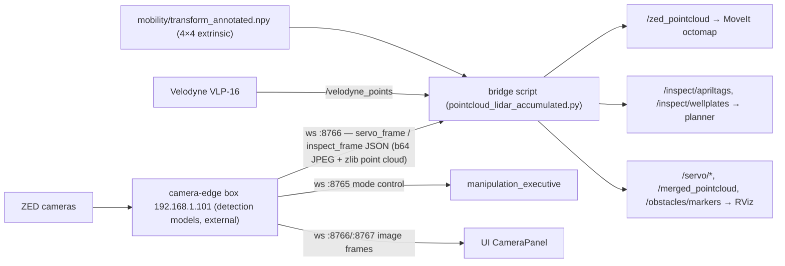

# Perception

**Purpose:** get camera detections (AprilTags, well plates), camera imagery, and fused point clouds into ROS 2 so the planner can see targets and MoveIt can see obstacles.

!!! note "⚠ Mostly outside the ROS workspace — and partly outside the repo"
    The in-workspace `perception_bringup` package is an **empty stub**. Real perception is split between:

    1. the **Xavier** (`autolab@192.168.1.101`, `~/Autolab-Camera-Edge`) running the detection models — its code is **not in this repo**; see [Camera-Edge (Xavier)](xavier.md);
    2. **machine-local bridge scripts at the repo root** (`pointcloud_lidar*.py`, `pc3.py`, `pc4.py`) — **not committed to git**; they exist only on the robot host.

## Architecture



## The camera-edge box (external)

The box is a Jetson **Xavier**, hostname `xavier.autolab` (192.168.10.7 on the WiFi subnet, 192.168.1.101 on the wired one; earlier scripts used 192.168.1.50). The ZED X cameras are attached to it, and **all inference happens there**: YOLO wellplate detection (the `best.pt` family — training artifacts and TensorRT exports live on the robot Jetson in `~/coding/percep/normal/` and `~/farnaz_perception/`), AprilTag detection, and lifting each 2D box to a 3D `pose` with ZED depth. The robot Jetson never sees raw frames for inference; it receives finished detections. Drive the box by hand with its own dashboard (`example_client/test.html` — see the [Xavier page](xavier.md#the-dashboard-example_clienttesthtml)) or with `~/coding/percep/test_server.py` (`servo | inspect | idle | status | stop` → ws :8765).

One machine, three WebSocket ports:

| Port | Protocol | Consumer |
|---|---|---|
| 8765 | `{"cmd":"mode","mode":"inspect"\|"servo"}` + `{"cmd":"status"}` polling | `manipulation_executive` |
| 8766 | Streams `servo_frame` / `inspect_frame` / `idle` JSON messages (base64 JPEG images, zlib+base64 point clouds, detections) | the bridge scripts; UI "Active" camera tile |
| 8767 | Subscribe with `{"camera":"wrist"\|"base"}`, receive `{image_jpeg_b64}` frames | UI camera tiles |

If this box is down: UI camera tiles show "No signal", manipulation stalls in `ACTIVATING_INSPECT`, and the planner never receives detections. ([known issue #9](../known-issues.md))

## The bridge scripts (repo root, ⚠ local files, not in git)

All are variants of the same WS→ROS 2 bridge. Run **from the repo root** (they use the relative path `./mobility/transform_annotated.npy`), with the **system** `python3` in a plain terminal — `deactivate` any venv first (`websockets` lives in `/usr/lib/python3/dist-packages`; the repo `./venv` lacks scipy):

```bash
cd ~/coding/Autolab
python3 pointcloud_lidar_accumulated.py     # the one used in practice
```

| Script | Differences |
|---|---|
| `pc3.py` / `pc4.py` | Camera-only bridge (no LiDAR). Identical except `FRAME_ID`: `top_camera` (pc3) vs `velodyne` (pc4) |
| `pointcloud_lidar.py` | Adds VLP-16 fusion + optional obstacle detection. Latest-frame threaded design: a dedicated WebSocket reader thread and a `rclpy.spin_once` thread feed a single-slot mailbox so neither camera nor LiDAR starves. Obstacle detection (voxel → RANSAC ground removal → DBSCAN) is **off** (`ENABLE_OBSTACLE_DETECTION = False`, costs 200–400 ms/call) |
| `pointcloud_lidar_accumulated.py` | Accumulating variant: buffers 15 frames of both ZED and LiDAR clouds before publishing/saving; single asyncio loop; obstacle detection always on. Use it to (re)build the `.npy` caches |

**Published topics:** `/servo/{image,annotated_image,detections,target}`, `/inspect/{image,annotated_image,wellplates,apriltags}`, `/zed_pointcloud`, `/vlp16_accumulated`, `/merged_pointcloud` (ZED = blue, VLP-16 = red), `/obstacles/markers`.

**Config constants at the top of each script:** `WS_URI = "ws://192.168.1.101:8766"`, `LIDAR_TOPIC = "/velodyne_points"`, `TRANSFORM_PATH = "./mobility/transform_annotated.npy"`, `USE_PC_CACHE`.

**Frame conventions:** ZED clouds get `Y *= -1` (Y-down → Y-up); VLP-16 points are remapped `(x,y,z) → (-y,z,x)`; the merged cloud is published in frame `velodyne`.

## Calibration data

`mobility/transform_annotated.npy` is the 4×4 ZED→VLP-16 extrinsic. **No tool in this repo produces it** — it came from an external calibration procedure (likely on the camera-edge box). Treat it as precious; there is a `_bkp` copy beside it. Without it the merged cloud is disabled.

## Point-cloud caches

`pc3_accumulated.npy` (ZED) and `vlp16_accumulated.npy` (Velodyne) at the repo root are startup caches: on boot the scripts load them instead of waiting to re-accumulate frames, and they re-save as new data arrives. Safe to delete (they regenerate), but the next start is slower. See [Data Files](../reference/data-files.md).

## On-robot camera drivers

The dual-ZED driver runs in its own container (`zed-l4t` service, Jetson profiles):

```bash
ros2 launch zed_wrapper zed_dual_camera.launch.py \
    pose_cam_serial:='41591402' wire_cam_serial:='44405253' \
    camera_name:="robot_1/sensors" node_name:="front_stereo"
```

The Velodyne driver lives in a separate host workspace on the robot Jetson (ROS Jazzy):

```bash
cd ~/coding/vlp16 && source install/setup.bash
ros2 launch vlp16_rviz vlp16_rviz.launch.py start_rviz:=false     # VLP-16 at 192.168.1.202 → /velodyne_points
```
