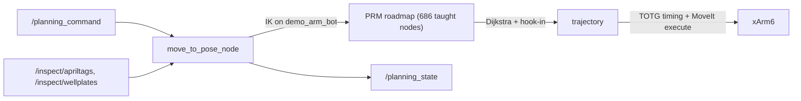

# Planning & Arm Motion

**Purpose:** everything between "the executive wants the arm at the well plate" and "the xArm6 joints move": MoveIt configuration, the custom PRM/constrained-RRT planner, and the taught-waypoint roadmap toolchain.

**Copy-paste version:** [Planning Quickstart](../planning-quickstart.md).

All paths below are under `robot/ros_ws/src/autonomy/5_planning/` unless noted.

## Components

| Package | Role |
|---|---|
| `base_urdf` | URDF + meshes of the composite robot (`robot.urdf`: swerve chassis, xArm6 links, gripper fingers, camera, well-plate holder) |
| `base_moveit_config_2` | MoveIt config for that composite robot, named **`demo_bot`** |
| `planning_bringup` | Launches the **stock xArm6 MoveIt stack** + real-arm driver |
| `global_planner` | The custom planner node `move_to_pose_node` + PRM/RRT headers + waypoint tools |
| `xarm_ros2` (vendored) | UFACTORY driver stack: `xarm_api`, `xarm_controller`, `xarm_moveit_config`, `xarm_msgs`, `xarm_moveit_servo`, … (~90 launch files) |

!!! warning "Two robot models in one stage"
    `planning_bringup` launches the **stock** `xarm_moveit_config` (planning group `xarm6`), while `move_to_pose_node` plans against **`demo_bot`** groups (`demo_arm_bot`, EE link `end_effector_p4_1`) from `base_moveit_config_2`. Verify on hardware which MoveIt config is actually serving `move_group` in your session before debugging planning failures. ([known issue #12](../known-issues.md))

## MoveIt config (`base_moveit_config_2`)

- **URDF:** `config/demo_bot.urdf.xacro` = `base_urdf/robot.urdf` + the xArm6 `ros2_control` xacro with plugin `uf_robot_hardware/UFRobotSystemHardware` (real arm, takes `robot_ip`). A commented-out `topic_based_ros2_control` block exists for Isaac Sim.
- **SRDF:** `config/demo_bot.srdf` — groups `demo_arm_bot` (chain `Chassis_1 → end_effector_p4_1`, joints `joint1..joint6`) and `demo_gripper_bot` (`Slider_1`, `Slider_2`); named states `home_arm`, `gripper_open`; the 8 swerve joints are passive.
- **Controllers:** `config/ros2_controllers.yaml` — `demo_arm_bot_controller` and `demo_gripper_bot_controller` (both `JointTrajectoryController`, 100 Hz) + `joint_state_broadcaster`.
- **Octomap:** `config/sensors_3d.yaml` — `PointCloudOctomapUpdater` consuming **`/zed_pointcloud`** (max range 1.5 m, resolution 3 cm). This is how live perception becomes collision geometry; if [the perception bridge](perception.md) isn't running, MoveIt plans as if the world were empty.
- **Pipelines:** `config/move_group.yaml` — OMPL (default), CHOMP, Pilz.
- **Constraint:** `config/path_constraints.yaml` — a `pointing_down` orientation constraint on `end_effector_p4_1` (the gripper must stay pointed down while carrying plates).

```bash
ros2 launch base_moveit_config_2 demo.launch.py          # full demo (fake hardware + RViz)
ros2 launch base_moveit_config_2 move_group.launch.py    # planning server only
ros2 launch base_moveit_config_2 moveit_rviz.launch.py   # RViz MoveIt panel
```

## Bringing up the real arm

```bash
ros2 launch planning_bringup planning.launch.xml robot_ip:=192.168.1.236 hw_ns:=xarm
# which internally runs:
# ros2 launch xarm_moveit_config xarm6_moveit_realmove.launch.py \
#     robot_ip:=192.168.1.236 dof:=6 robot_type:=xarm hw_ns:=xarm no_gui_ctrl:=false
```

Other useful vendored entry points:

```bash
ros2 launch xarm_moveit_config xarm6_moveit_fake.launch.py            # no hardware
ros2 launch xarm_api xarm6_driver.launch.py robot_ip:=192.168.1.236   # driver only
ros2 launch xarm_moveit_servo xarm_moveit_servo_realmove.launch.py robot_ip:=192.168.1.236
```

## The custom planner: `global_planner/move_to_pose_node`

Source: `global_planner/src/move_to_pose_node.cpp` (~930 lines). **You don't start it yourself:** `planning.launch.xml` includes the team-modified vendored `xarm_moveit_config/launch/_robot_moveit_realmove.launch.py`, which spawns `move_to_pose_node` 15 s after launch (`TimerAction`, line 174) and publishes the static TFs `world → link_base` and `Chassis_1 → top_camera` (lines 226–230). Starting it again by hand gives two planners on `/planning_command` ([#26](../known-issues.md)) — and `ros2 run` isn't installed in the robot image anyway ([#31](../known-issues.md)); if you ever need it alone, run the binary `install/global_planner/lib/global_planner/move_to_pose_node`.

!!! warning
    `README_planning.md` says `ros2 launch global_planner move_and_rviz.launch.py` — **that launch file no longer exists**, and the README describes the retired RRT\*+CHOMP two-stage design (`move_to_pose_node_old*.cpp`), not the current node. ([known issues #3, #13](../known-issues.md))

It is a command-driven planning server, polled at 1 Hz:

**Subscribes:** `/planning_command` (String), `/task_planner/task_type` (String — never published by anything, [#24](../known-issues.md)), `/joint_states`, `/inspect/apriltags` + `/inspect/wellplates` (MarkerArray, BEST_EFFORT), `/zed_pointcloud`.
**Publishes:** `/planning_state` (String: `IDLE | PLANNING | EXECUTING | SUCCESS | ERROR`), `/display_planned_path`, `/target_pose_marker`, `/target_points_marker`.
**Service clients:** `/controller_manager/{list,switch}_controller` (activates `xarm6_traj_controller`), and xArm error-recovery services (`/xarm/clean_error`, `/xarm/motion_enable`, `/xarm/set_state` — the recovery call site is currently commented out).

**Command vocabulary** (send as `std_msgs/String` on `/planning_command`):

| Command | Meaning |
|---|---|
| `plan_april_<id>` | Plan to **25 cm above** AprilTag `<id>` (1 = OT-2, 2 = shaker). Hover only — the same command is used for pick and place ([#21, #24](../known-issues.md)) |
| `plan_wellplate` | Plan to the detected well plate |
| `plan_home` | Plan to the home configuration |
| `plan_home_offset` | Plan to a safe offset above home |
| `idle` | Return to idle |

The node transforms detections from frame `top_camera` into `world` (the TF resolves to `[-0.013, 0.266, 1.477]`; detections come from the [Xavier](xavier.md) via `pc3.py`), applies a pre-grasp offset, enforces an end-effector-down constraint (roll/pitch within ±0.2 rad, yaw free), clamps targets to the workspace box `x∈[-0.15,0.85] y∈[±0.50] z∈[0.90,1.30]`, solves IK on `demo_arm_bot`, plans with `prm_plan()`, and executes.

### PRM / constrained-RRT internals

Header-only, in `global_planner/src/`:

| File | Contents |
|---|---|
| `crrt_types.hpp` | Tunables (`STEP_SIZE 0.05`, `GOAL_BIAS 0.3`, `MAX_ITER 5000`), node types, **hardcoded container paths** `PRM_ROADMAP_FILE=/home/robot/AutoLab/robot/prm_roadmap.bin`, `MANUAL_WAYPOINTS_FILE=/home/robot/AutoLab/robot/manual_waypoints_0.json`, and a singleton PlanningSceneMonitor |
| `crrt_validity.hpp` | EE-down check, collision checks, steering, Halton sampling, path densify/smooth, TOTG time-parameterization |
| `crrt_prm.hpp` | Roadmap build: inject manual waypoints → Halton global samples → K-NN collision-checked edges → binary save (waits up to 15 s for the octomap to appear first) |
| `crrt_plan.hpp` | `prm_plan()`: load/build roadmap, hook start+goal in (K=50), **Dijkstra**; fallback = two-stage plan through a hardcoded midpoint configuration. `crrt_plan()`: bidirectional constrained RRT-Connect with 15% waypoint-library bias |
| `constrained_rrt.hpp`, `dummy_cloud.hpp` | Standalone CRRT variant; procedural fallback obstacle |
| `move_to_pose_node_old*.cpp` | Dead prior revisions (the RRT\*+CHOMP design) |

Planning flow, end to end:



## The taught-waypoint / roadmap toolchain

The PRM roadmap is seeded from **hand-taught waypoints**: you physically guide the arm through good configurations, record them, and bake them into the roadmap. Data files live in `robot/` at the repo root — see [Data Files](../reference/data-files.md) for formats.

!!! danger
    `record_waypoints.py` puts the arm in **manual/teach mode (mode 2)** — it becomes freely movable by hand. Support its weight before recording.

| Tool | What it does | Run |
|---|---|---|
| `global_planner/src/record_waypoints.py` | Teach-pendant recorder. Connects directly to the arm (`192.168.1.236`, xArm SDK, no ROS), sets teach mode, interactive REPL (Enter = record, `n` = note, `d` = delete, `s` = show, `q` = save+quit) → `manual_waypoints.json` | `python3 record_waypoints.py` |
| `global_planner/src/record_waypoints_ros2.py` | Same, but records from the ROS `/joint_states` topic instead of the SDK | `python3 record_waypoints_ros2.py` |
| `global_planner/src/inject_waypoints_node.py` | Adds waypoints to `prm_roadmap.bin` with **no collision checking** (trusts taught waypoints; K=15 neighbors). Pure Python, not a ROS node despite the name | `python3 inject_waypoints_node.py` |
| `robot/add_waypoints_to_roadmap.py` (repo root `robot/`) | The validating version: DOF/duplicate/EE-down/collision checks + collision-checked edges. ⚠ **currently broken** — its MoveItPy init is commented out, so it hits a `NameError` at the first constraint check ([known issue #4](../known-issues.md)) | `python3 robot/add_waypoints_to_roadmap.py` |
| `global_planner/src/visualize_roadmap.py` | Offline matplotlib 3D plot of the roadmap (joints 0–2 as XYZ). ⚠ hardcodes the **host** path `/home/labx/coding/Autolab/robot/prm_roadmap.bin`; writes `/tmp/prm_roadmap.png`. Needs `numpy` + `matplotlib` (not in the host system Python — `pip install matplotlib` first) | `python3 visualize_roadmap.py` |

!!! note "Container vs host paths"
    The C++ planner and most waypoint tools hardcode the **in-container** path `/home/robot/AutoLab/robot/...`; only `visualize_roadmap.py` uses the host path. Run each tool where its path exists.

## Gotchas specific to this subsystem

- If `/zed_pointcloud` never arrives, roadmap **building** stalls ~15 s waiting for the octomap, then proceeds with an obstacle-free scene — plans will be optimistic.
- `move_to_pose_node` activates `xarm6_traj_controller` via the controller manager; if the stock xArm MoveIt stack isn't up (or the controller is named differently in your session), execution fails after planning succeeds.
- Old roadmap/waypoint snapshots (`prm_roadmap_old.bin`, `manual_waypoints_{old,old2,huge,v1}.json`, `bottleneck_waypoints.json`) are historical; only `prm_roadmap.bin` + `manual_waypoints_0.json` are read by the code.
